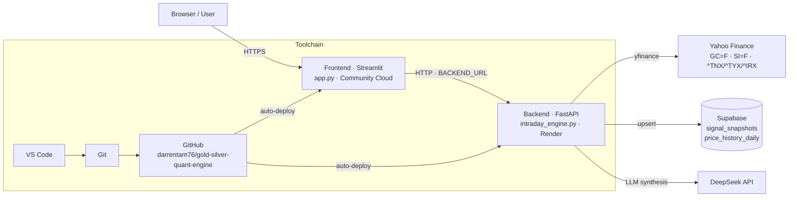

# Architecture

## Runtime overview

```
                        ┌─────────────────────────────┐
                        │         BROWSER (user)       │
                        │   dashboard + live charts    │
                        └──────────────┬──────────────┘
                                       │  HTTPS (public)
                        ┌──────────────▼──────────────┐
                        │  FRONTEND  ·  Streamlit      │
                        │  app.py  (dashboard UI)      │
                        │  Streamlit Community Cloud   │
                        └──────────────┬──────────────┘
                                       │  HTTP requests  (BACKEND_URL secret)
                        ┌──────────────▼──────────────┐
                        │  BACKEND  ·  FastAPI         │
                        │  intraday_engine.py  v0.2.4  │
                        │  uvicorn · Python 3.14       │
                        │  Render (free, auto-deploy)  │
                        └───┬──────────────┬──────────┘
                            │              │
              ┌─────────────▼───┐  ┌──────▼───────────────┐
              │  Supabase       │  │  DeepSeek API        │
              │  (PostgreSQL)   │  │  /insights → LLM     │
              │  signal_snapshots│  │  executive commentary│
              │  price_history_  │  │                      │
              │    daily         │  └──────────────────────┘
              └───────┬─────────┘
                      │
              ┌───────▼─────────┐
              │  yfinance       │
              │  (Yahoo Finance)│  ← GC=F, SI=F, ^TNX/^TYX/^IRX
              │  live + daily   │
              └─────────────────┘
```

## Data flow

1. The Streamlit dashboard calls the FastAPI backend (`BACKEND_URL`) for
   signals, live quotes, yearly history, and the Supabase price archive.
2. The backend ingests 1-minute and daily bars from **yfinance** (Yahoo
   Finance): gold futures (`GC=F`), silver futures (`SI=F`), and Treasury
   yields (`^TNX`, `^TYX`, `^IRX`).
3. The quant pipeline computes Z-scores, regime/arbitrage flags, real rates,
   and yield-curve slopes, then serves them behind short TTL caches.
4. Signal snapshots are upserted into Supabase `signal_snapshots` (one row per
   unique bar); daily OHLCV bars are mirrored into `price_history_daily`.
5. The **DeepSeek API** generates executive commentary for a signal payload
   (dashboard "AI Commentary" tab).

## Development toolchain

```
  VS Code ──► Git ──► GitHub (darrentam76/gold-silver-quant-engine)
                     │
                     ├──► Render (backend, auto-deploy on push)
                     └──► Streamlit Cloud (frontend, deploys from repo)
```

- **Editor:** Visual Studio Code (Git for version control)
- **Language:** Python 3.14
- **Prompting:** Claude & Gemini assist with code generation
- **Code hosting:** GitHub (`darrentam76/gold-silver-quant-engine`)
- **Database:** Supabase (PostgreSQL)
- **LLM API key:** DeepSeek

## Mermaid version (renders on GitHub)


