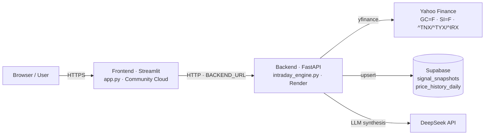

# Gold, Silver & Real Rates Quant Engine (v0.2.4)

Institutional precious metals (XAU/XAG) & yield-curve quantitative trading system:
a FastAPI backend (`intraday_engine.py`) + Streamlit dashboard (`app.py`).

## Architecture

- **Backend (FastAPI)** — 1-minute yfinance ingestion with futures-primary routing
  (`GC=F`/`SI=F`), 30-bar basis adjustment, joint GSR quality gating, dual-modality
  Z-scores (macro velocity on changes, stat-arb on levels), dual hysteresis state
  machines, 60s server-side TTL cache, and Supabase snapshot persistence.
- **Dashboard (Streamlit)** — live signal terminal, Supabase-backed analytics
  (per-GMT+8-trading-day summaries + charts), and DeepSeek executive commentary.
- **Persistence (Supabase)** — `signal_snapshots` table, unique per bar
  (`data_as_of` upsert), with a derived `trading_date_gmt8` column. Daily OHLCV
  bars are mirrored to `price_history_daily` (per-symbol per-trading-day upsert),
  seeded via the backfill endpoint and refreshed on every fresh 1Y history fetch.



See [ARCHITECTURE.md](ARCHITECTURE.md) for the full diagram and data-flow
explanation.

### API

| Endpoint | Description |
|---|---|
| `GET /api/v1/signals` | Latest signal state (`breakeven_10y`, `period` params) |
| `GET /api/v1/history` | Persisted snapshots, newest first (`limit`, `trading_date` params) |
| `GET /api/v1/history/daily` | Per-GMT+8-trading-day aggregates |
| `GET /api/v1/live` | Live quotes + yields (`breakeven_10y` param), 10s cache |
| `GET /api/v1/live/yearly` | 1Y/6M/3M/1M daily history (`period` param), 1h cache |
| `POST /api/v1/price-history/backfill` | Download & persist daily OHLCV into Supabase (`days` param) |
| `GET /api/v1/price-history` | Archived daily OHLCV from Supabase (`symbol`/`start`/`end`/`limit` params) |
| `POST /api/v1/insights` | DeepSeek executive synthesis for a signal payload |
| `GET /api/v1/reject` | Out-of-scope asset rejection |

## Local Run

```bash
python -m venv .venv
.venv\Scripts\activate            # Windows
pip install -r requirements.txt
copy .env.example .env            # supply SUPABASE_URL, SUPABASE_KEY, DEEPSEEK_API_KEY

.venv\Scripts\python intraday_engine.py   # FastAPI on :8000
.venv\Scripts\python -m streamlit run app.py   # dashboard on :8501
```

The dashboard reads `BACKEND_URL` (default `http://localhost:8000`).

## Deployment

### 1. Backend on Render (free)

1. Push this repo to GitHub.
2. Render → New → Blueprint, connect the repo. `render.yaml` creates the
   `gold-silver-quant-engine` web service automatically.
3. During creation Render prompts for the secrets (`sync: false` in
   `render.yaml`): `SUPABASE_URL`, `SUPABASE_KEY`, `DEEPSEEK_API_KEY`.
4. Note the service URL, e.g. `https://gold-silver-quant-engine.onrender.com`.

### 3. Post-deploy verification

```bash
# 1. Backend health (takes ~1 min on first cold start)
curl "https://gold-silver-quant-engine.onrender.com/api/v1/live?breakeven_10y=2.28"

# 2. Live yearly history
curl "https://gold-silver-quant-engine.onrender.com/api/v1/live/yearly?period=1y"

# 3. Persistence reachable
curl "https://gold-silver-quant-engine.onrender.com/api/v1/history?limit=1"
```

Then open the Streamlit app and confirm the Live prices tab shows
`MARKET LIVE` / real yields and the Analytics tab is reachable (cold start
on free tier means first load takes ~1 min).

### 2. Dashboard on Streamlit Community Cloud

1. Sign in to https://share.streamlit.io with your GitHub account.
2. New app → pick this repo → branch `main` → main file `app.py` → Deploy.
3. Settings → Secrets → add `BACKEND_URL` = your Render URL
   (e.g. `https://gold-silver-quant-engine.onrender.com`).

Note: Render's free tier sleeps after ~15 min idle; the first fetch after an idle
period takes ~1 min (cold start).
